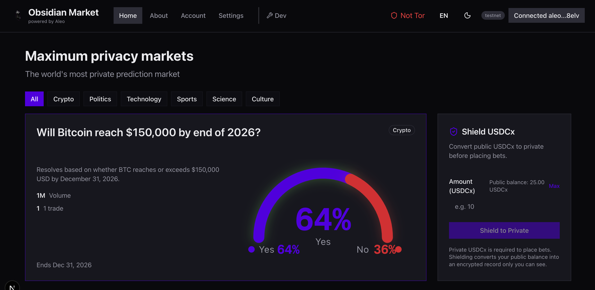

# Obsidian Market

**Privacy-first prediction markets on Aleo**

🔗 [Live Demo](https://obsidian-market.vercel.app/) | [Smart Contract](https://testnet.explorer.provable.com/program/obsidian_market_v2.aleo) | [Dev Sanity Check](https://obsidian-market.vercel.app/en/dev/onchain)



---

## The Problem

Traditional prediction markets have a privacy problem. When you bet on Polymarket or Kalshi, your positions are public. Anyone can see what you're betting on, how much, and when. This creates real issues:

- **Market manipulation**: Whales front-run large trades, moving prices before your order fills
- **Privacy invasion**: Your political views, financial predictions, and risk appetite are broadcast to the world
- **Surveillance**: Governments and corporations can track every position you take
- **Social pressure**: Friends, employers, or communities judge your bets

Obsidian Market solves this by making your bets private while keeping markets functional and fairly priced.

---

## How We Use Aleo's Privacy

This is where Aleo's zero-knowledge architecture becomes critical. We built a **hybrid public/private model** that gives you privacy where it matters:

### Private: Your Bets (BetRecords)

When you place a bet, you receive a private `BetRecord` that only you can decrypt. This record contains:

- Market ID
- Bet amount (shares)
- Which side you picked (Yes/No)
- Your payout rights

**Your view key is the only way to see this data.** Not even the smart contract admin can decrypt your positions. This is pure Aleo zero-knowledge magic—you prove you own the record and can claim payouts without revealing what you bet on or how much.

### Public: Market Reserves

For the automated market maker (AMM) to work, we need public price discovery. Market reserves are stored on-chain publicly so everyone sees the same odds. This is similar to how Uniswap pools work—the pricing mechanism needs transparency, but your individual trades don't.

When you bet, the smart contract:

1. Updates public reserves (for CPMM pricing)
2. Issues you a private BetRecord (encrypted to your view key)
3. Emits zero public information about your bet size or direction

### Why This Matters

Aleo is the only blockchain where we could build this. Ethereum makes everything public by default. Aztec and other privacy chains require complex workarounds. Aleo's record model and zero-knowledge proofs make private betting **native and composable**.

The trade-off: reserve changes leak some information (if reserves jump by 100 USDCx, someone bet 100 USDCx). But this is inherent to any AMM—we've documented privacy improvements like bet batching, timing jitter, and fixed denominations in our [privacy research doc](./docs/privacy-ideas.md).

---

## What You Can Do

Right now, Obsidian Market lets you:

✅ **Browse 20 markets** across crypto, politics, tech, sports, and science
✅ **Bet with USDCx** (Aleo's testnet stablecoin) in public mode
✅ **See live pricing** via CPMM (constant product market maker)
✅ **Track your positions** privately via BetRecords
✅ **One-click betting** with Leo Wallet integration—see odds, pick Yes/No, confirm transaction

Markets show real-time prices like "Yes 64% / No 36%" with ROI displayed prominently. When you bet Yes at 64%, you're paying 64¢ for $1 if the outcome resolves Yes—a 56% return if you're right.

---

## Architecture

We split concerns between on-chain logic (Aleo) and off-chain metadata (Supabase):

### Smart Contract ([obsidian_market_v2.aleo](https://testnet.explorer.provable.com/program/obsidian_market_v2.aleo))

Written in Leo, deployed on Aleo testnet. Handles:

- Market creation (admin-only, controlled by one address)
- CPMM betting (constant product AMM formula)
- Issuing private BetRecords to users
- Market resolution and payouts

The contract stores market reserves as `u128` values (upgraded from `u64` in v1 for larger capacity). Uses USDCx via `test_usdcx_stablecoin.aleo` for stable denomination.

### Frontend (Next.js 14 + TypeScript)

Modern web app with shadcn/ui components and Tailwind CSS. Connects to Leo Wallet via Provable's wallet adapter. The UI is internationalized (i18n) and works in light/dark mode.

### Database (Supabase PostgreSQL)

Stores market metadata that doesn't belong on-chain:

- Market titles, descriptions, resolution rules
- Deadlines, categories, featured status
- Links to on-chain market IDs (`market_id_onchain`)

This hybrid approach keeps gas costs low—only critical logic lives on-chain.

---

## Current State & Roadmap

**Shipped (v2.0.0):**

- Smart contract v2 with u128 reserves
- USDCx public betting (stablecoin integration)
- Inline betting UX (removed extra click friction)
- ROI display on betting buttons
- Transaction validation and explorer links
- 20 seeded markets across 5 categories
- [Privacy threat model research](./docs/privacy-ideas.md) (14 identified improvements)

**Next Up (Unreleased):**

- Private USDCx betting (currently public only)
- Fixed denomination bets (1, 5, 10, 50, 100 USDCx) for privacy
- Bet timing jitter (5-30 min delays to prevent timing correlation)
- Batched market payouts
- .onion service for Tor Browser users
- Database encryption (trades table currently links tx_hash to market_id)
- Reserve management and liquidity improvements

We've documented a comprehensive privacy roadmap with trade-off analysis—some improvements are quick wins (fixed denominations), others require deep protocol changes (ZK mixers, commit-reveal schemes).

---

## Why It Matters

Prediction markets are powerful tools for forecasting elections, tech launches, scientific breakthroughs, and financial events. But they only work if people are willing to share their true beliefs. Privacy enables that.

On Obsidian Market, you can bet on controversial political outcomes, express contrarian tech opinions, or make high-conviction financial predictions without fear of retaliation, front-running, or surveillance. Your view key is your privacy—guard it well.

This is early-stage, testnet software. But it's a proof of concept that privacy-preserving prediction markets are possible, practical, and already working on Aleo.

---

## Try It

**Live deployment:** https://obsidian-market.vercel.app/

**Requirements:**

- Leo Wallet (browser extension)
- Testnet Aleo credits (for transaction fees)
- Testnet USDCx (for betting—get via faucet or swap)

**Dev sanity check:** https://obsidian-market.vercel.app/en/dev/onchain
Shows all 20 on-chain markets with reserves and status, alongside Supabase data.

---

## Quick Start (Local Development)

```bash
# 2. Deploy smart contract
cd aleo && leo deploy --broadcast --yes

# 3. Start Supabase
cd backend && supabase start

# 4. Reset database and seed on-chain markets
npm run db:reset:local   # Creates 20 market rows
npm run seed-aleo        # Deploys markets 1-20 on-chain

# 5. Run frontend
cd frontend && npm run dev
```

Full setup details in [Deployment Guide](./docs/deployment-guide.md).

---

## Technical Details

**Stack:**

- Leo 3.4.0 (Aleo smart contract language)
- Next.js 14 with App Router
- TypeScript, Tailwind CSS v4, shadcn/ui
- Supabase (PostgreSQL + REST API)
- Aleo Wallet Adapter (@provablehq)

**Smart Contract Highlights:**

- CPMM pricing (constant product market maker)
- Private BetRecords (zero-knowledge proofs)
- USDCx stablecoin integration
- Admin-controlled market lifecycle
- u128 reserves (handles large markets)

**Key Files:**

- [aleo/src/main.leo](./aleo/src/main.leo) - Smart contract
- [frontend/src/components/BetForm.tsx](./frontend/src/components/BetForm.tsx) - Betting UI
- [frontend/src/lib/aleo.ts](./frontend/src/lib/aleo.ts) - Wallet integration
- [scripts/seed-markets.sh](./scripts/seed-markets.sh) - On-chain market creation
- [docs/privacy-ideas.md](./docs/privacy-ideas.md) - Privacy threat model

---

## Privacy Research

See [privacy-ideas.md](./docs/privacy-ideas.md) for full analysis and 14 prioritized mitigations with trade-off analysis.

---

## License

See [LICENSE.txt](./LICENSE.txt).

---

## Links

- [GitHub Repo](https://github.com/adamsimonini/obsidian-market)
- [Testnet Smart Contract](https://testnet.explorer.provable.com/program/obsidian_market_v2.aleo)
- [USDCx Stablecoin Program](https://testnet.explorer.provable.com/program/test_usdcx_stablecoin.aleo)
- [Supabase Dashboard](https://supabase.com/dashboard/project/giarcxkfqogumngtygmt)
- [Aleo Wallet Adapter](https://github.com/ProvableHQ/aleo-wallet-adapter)
