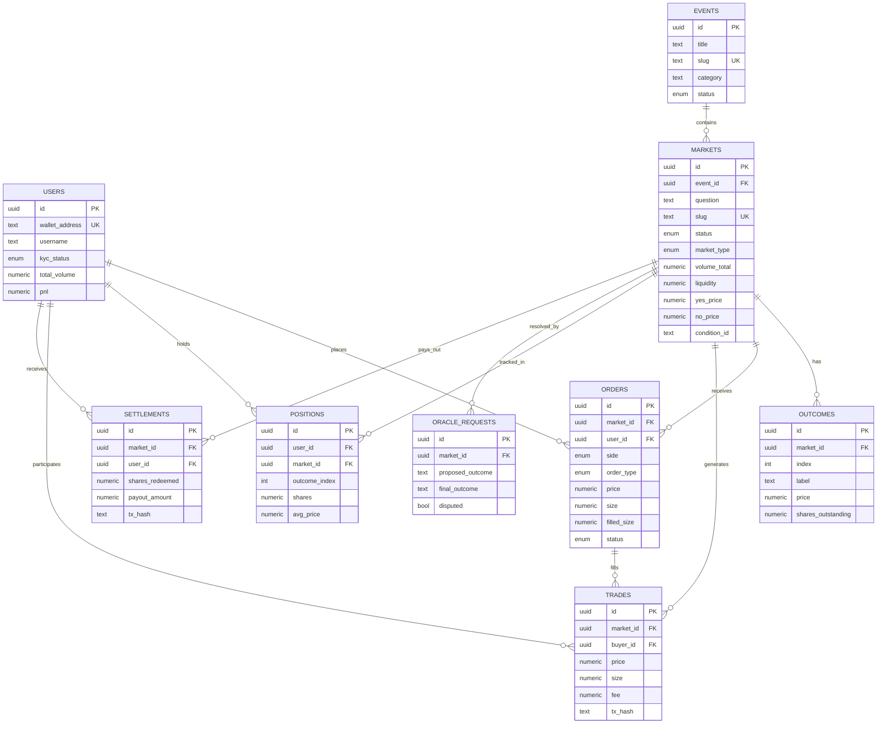

# Polymarket Database Architecture Analysis & Obsidian Market Comparison

## Executive Summary

This report reverse-engineers the likely database architecture of Polymarket (and references Augur, Kalshi) based on public APIs, smart contract analysis, known infrastructure patterns, and prediction market domain expertise. It then compares these structures against Obsidian Market's current MVP schema to identify gaps, validate design choices, and recommend a pragmatic evolution path.

**Key finding:** Obsidian Market's MVP schema covers ~15% of what a production prediction market needs. This is appropriate for an MVP, but critical entities (trades, positions, users, settlements) are missing. The privacy-first design on Aleo is a genuine differentiator, but the off-chain schema must compensate for what the blockchain intentionally hides.

---

## 1. Polymarket Estimated Database Architecture

### 1.1 Infrastructure Overview

| Layer | Polymarket (Estimated) | Obsidian Market (Current) |
|-------|----------------------|--------------------------|
| **Blockchain** | Polygon (EVM), CTF Exchange contracts | Aleo (Leo), `obsidian_market.aleo` |
| **Indexer** | The Graph / custom indexer | None (manual sync) |
| **Primary DB** | PostgreSQL (likely Aurora/RDS) | Supabase (PostgreSQL) |
| **Cache** | Redis (order books, prices) | None |
| **Auth** | Wallet signature + session tokens | Wallet address only (no auth) |
| **Order Matching** | CLOB (Central Limit Order Book) off-chain | CPMM on-chain |
| **Oracle** | UMA Optimistic Oracle | Admin manual resolution |

### 1.2 Estimated Entity Schemas

#### `users` / `traders`

Polymarket tracks users for KYC compliance, portfolio display, and leaderboard.

| Column | Type | Notes |
|--------|------|-------|
| `id` | UUID PK | Internal ID |
| `wallet_address` | TEXT UNIQUE NOT NULL | Primary Polygon address |
| `username` | TEXT UNIQUE | Display name |
| `avatar_url` | TEXT | Profile image |
| `bio` | TEXT | Profile bio |
| `kyc_status` | ENUM | `none`, `pending`, `verified`, `rejected` |
| `kyc_provider_id` | TEXT | Reference to KYC provider (Jumio, etc.) |
| `geo_region` | TEXT | For regulatory gating (US restrictions) |
| `total_volume` | NUMERIC | Denormalized for leaderboard |
| `pnl` | NUMERIC | Denormalized profit/loss |
| `created_at` | TIMESTAMPTZ | |
| `last_active_at` | TIMESTAMPTZ | Session tracking |

**Obsidian Market equivalent:** `admins` table only. No user table exists. Users are identified solely by wallet address in `creator_address` on the markets table. This is fine for MVP but blocks leaderboards, user portfolios, and any future KYC needs.

---

#### `events` (grouping entity)

Polymarket groups related markets under events (e.g., "2024 US Election" contains "Will Biden win?", "Will Trump win?", etc.).

| Column | Type | Notes |
|--------|------|-------|
| `id` | UUID PK | |
| `title` | TEXT NOT NULL | "2024 US Presidential Election" |
| `slug` | TEXT UNIQUE | URL-friendly identifier |
| `description` | TEXT | |
| `category` | TEXT | `politics`, `sports`, `crypto`, `science` |
| `image_url` | TEXT | Event banner |
| `start_date` | TIMESTAMPTZ | When event becomes relevant |
| `end_date` | TIMESTAMPTZ | Expected resolution window |
| `status` | ENUM | `active`, `resolved`, `cancelled` |
| `featured` | BOOLEAN | For homepage promotion |
| `created_at` | TIMESTAMPTZ | |

**Obsidian Market equivalent:** None. Markets are flat. Adding an `events` or `categories` table would help organize markets at scale.

---

#### `markets`

The core entity. Polymarket's markets are binary outcome (Yes/No) or multi-outcome, each backed by Conditional Token Framework (CTF) contracts on Polygon.

| Column | Type | Notes |
|--------|------|-------|
| `id` | UUID PK | Internal ID |
| `event_id` | UUID FK → events | Parent grouping |
| `question` | TEXT NOT NULL | "Will BTC hit $100k by Dec 2024?" |
| `slug` | TEXT UNIQUE | URL-friendly |
| `description` | TEXT | Extended context |
| `resolution_source` | TEXT | "CoinGecko price at midnight UTC" |
| `resolution_rules` | TEXT | Detailed rules |
| `resolution_deadline` | TIMESTAMPTZ | When resolution must happen |
| `resolved_at` | TIMESTAMPTZ | Actual resolution time |
| `resolution_outcome` | TEXT | `yes`, `no`, `invalid`, NULL |
| `status` | ENUM | `pending`, `active`, `halted`, `resolved`, `voided` |
| `market_type` | ENUM | `binary`, `multi_outcome`, `scalar` |
| `collateral_token` | TEXT | USDC address (Polymarket) |
| `condition_id` | TEXT | CTF condition ID on-chain |
| `question_id` | TEXT | UMA oracle question ID |
| `volume_total` | NUMERIC | Denormalized total volume |
| `volume_24h` | NUMERIC | Denormalized rolling volume |
| `liquidity` | NUMERIC | Current pool liquidity |
| `yes_price` | NUMERIC(10,4) | Current yes share price (0.00-1.00) |
| `no_price` | NUMERIC(10,4) | Current no share price |
| `yes_bid` | NUMERIC(10,4) | Best bid for yes shares |
| `yes_ask` | NUMERIC(10,4) | Best ask for yes shares |
| `creator_id` | UUID FK → users | Who created it |
| `fee_bps` | INTEGER | Fee in basis points |
| `min_size` | NUMERIC | Minimum order size |
| `tags` | TEXT[] | Searchable tags |
| `image_url` | TEXT | Market thumbnail |
| `created_at` | TIMESTAMPTZ | |
| `updated_at` | TIMESTAMPTZ | |

**Obsidian Market equivalent:** The `markets` table covers basics (`title`, `description`, `resolution_rules`, `resolution_source`, `resolution_deadline`, `status`, `yes_odds`, `no_odds`, `creator_address`, `market_id_onchain`). Key gaps:

| Missing from Obsidian | Impact |
|----------------------|--------|
| `resolution_outcome` | Can't record what the result was |
| `resolved_at` | Can't track when resolution happened |
| `volume_total` / `volume_24h` | No trade volume data for UI |
| `liquidity` | Can't display pool depth |
| `slug` | No SEO-friendly URLs |
| `category` / `tags` | No filtering/discovery |
| `image_url` | No visual branding per market |
| `fee_bps` | No fee configuration per market |

The `yes_odds` / `no_odds` NUMERIC(10,2) fields represent fixed odds, whereas Polymarket uses dynamic prices (0.00-1.00 representing probability). Obsidian's on-chain contract uses CPMM reserves (`yes_reserves`, `no_reserves`) which dynamically price, but this isn't reflected in the off-chain schema.

---

#### `outcomes`

For multi-outcome markets. Polymarket supports more than binary yes/no.

| Column | Type | Notes |
|--------|------|-------|
| `id` | UUID PK | |
| `market_id` | UUID FK → markets | |
| `index` | INTEGER | 0, 1, 2... |
| `label` | TEXT | "Yes", "No", "Trump", "Biden" |
| `token_id` | TEXT | CTF token ID on-chain |
| `price` | NUMERIC(10,4) | Current price |
| `shares_outstanding` | NUMERIC | Total shares minted |
| `resolved_payout` | NUMERIC | 0.00 or 1.00 after resolution |

**Obsidian Market equivalent:** None. Binary outcomes are implicit (yes/no fields on markets table). This is fine for binary-only MVP. If multi-outcome markets are needed later, this table becomes essential.

---

#### `orders`

Polymarket uses a CLOB (Central Limit Order Book). Orders are matched off-chain, settled on-chain.

| Column | Type | Notes |
|--------|------|-------|
| `id` | UUID PK | |
| `market_id` | UUID FK → markets | |
| `user_id` | UUID FK → users | |
| `side` | ENUM | `buy`, `sell` |
| `outcome_index` | INTEGER | Which outcome |
| `order_type` | ENUM | `limit`, `market`, `ioc` |
| `price` | NUMERIC(10,4) | Limit price |
| `size` | NUMERIC | Number of shares |
| `filled_size` | NUMERIC | How much has been filled |
| `status` | ENUM | `open`, `partially_filled`, `filled`, `cancelled`, `expired` |
| `tx_hash` | TEXT | Settlement transaction |
| `expires_at` | TIMESTAMPTZ | Order expiry |
| `created_at` | TIMESTAMPTZ | |
| `updated_at` | TIMESTAMPTZ | |

**Obsidian Market equivalent:** None. Obsidian uses CPMM (automated market maker) not CLOB, so a traditional order book isn't needed. However, there's no `trades` or `bets` table to record what happened. The on-chain `BetRecord` is private (only the user holds it), meaning the off-chain DB has zero visibility into trade history.

---

#### `trades` (filled orders / executions)

| Column | Type | Notes |
|--------|------|-------|
| `id` | UUID PK | |
| `market_id` | UUID FK → markets | |
| `buyer_id` | UUID FK → users | |
| `seller_id` | UUID FK → users | NULL for AMM trades |
| `outcome_index` | INTEGER | |
| `price` | NUMERIC(10,4) | Execution price |
| `size` | NUMERIC | Shares traded |
| `value` | NUMERIC | price * size (in collateral) |
| `buyer_order_id` | UUID FK → orders | |
| `seller_order_id` | UUID FK → orders | |
| `tx_hash` | TEXT | On-chain settlement |
| `fee` | NUMERIC | Platform fee taken |
| `created_at` | TIMESTAMPTZ | |

**Obsidian Market equivalent:** None. This is one of the biggest gaps. Without a trades table, you cannot display:
- Trade history on a market page
- Price charts (time series of trade prices)
- Volume calculations
- User portfolio history
- Platform revenue tracking

**Privacy consideration:** On Aleo, `BetRecord` is private. The off-chain DB could store anonymized/aggregated trade data (total volume, price after trade) without revealing who traded, preserving the privacy thesis while enabling UI features.

---

#### `positions`

Aggregated view of a user's holdings per market.

| Column | Type | Notes |
|--------|------|-------|
| `id` | UUID PK | |
| `user_id` | UUID FK → users | |
| `market_id` | UUID FK → markets | |
| `outcome_index` | INTEGER | |
| `shares` | NUMERIC | Net shares held |
| `avg_price` | NUMERIC(10,4) | Average entry price |
| `cost_basis` | NUMERIC | Total spent |
| `realized_pnl` | NUMERIC | P&L from closed positions |
| `created_at` | TIMESTAMPTZ | |
| `updated_at` | TIMESTAMPTZ | |

**Obsidian Market equivalent:** None. On Aleo, positions are private `BetRecord`s held by users. The off-chain DB intentionally has no visibility here. This is a feature (privacy), not a bug. Users query their own records client-side via the Aleo wallet.

---

#### `oracle_requests` / `resolutions`

Polymarket uses UMA's Optimistic Oracle for decentralized resolution.

| Column | Type | Notes |
|--------|------|-------|
| `id` | UUID PK | |
| `market_id` | UUID FK → markets | |
| `oracle_type` | ENUM | `uma`, `chainlink`, `manual` |
| `question_id` | TEXT | Oracle-specific question identifier |
| `proposed_outcome` | TEXT | Initial proposed resolution |
| `proposed_at` | TIMESTAMPTZ | |
| `proposer_address` | TEXT | Who proposed |
| `dispute_deadline` | TIMESTAMPTZ | Challenge window end |
| `disputed` | BOOLEAN | Was it challenged? |
| `final_outcome` | TEXT | Settled outcome |
| `resolved_at` | TIMESTAMPTZ | |
| `bond_amount` | NUMERIC | Stake for proposing |
| `tx_hash` | TEXT | Resolution transaction |

**Obsidian Market equivalent:** None. Resolution is manual admin action with no audit trail. The `resolution_source` field on `markets` is a text description, not a linked oracle. For MVP this works, but production needs at minimum a `resolutions` audit log.

---

#### `settlements` / `payouts`

Tracks redemption of winning shares after market resolution.

| Column | Type | Notes |
|--------|------|-------|
| `id` | UUID PK | |
| `market_id` | UUID FK → markets | |
| `user_id` | UUID FK → users | |
| `outcome_index` | INTEGER | |
| `shares_redeemed` | NUMERIC | |
| `payout_amount` | NUMERIC | In collateral token |
| `tx_hash` | TEXT | On-chain payout transaction |
| `created_at` | TIMESTAMPTZ | |

**Obsidian Market equivalent:** None. The on-chain contract doesn't have a `claim_winnings` transition yet either.

---

### 1.3 Entity Relationship Diagram



---

## 2. Data Flow: On-Chain vs Off-Chain

### 2.1 Polymarket Pattern (Polygon/EVM)

```
User Action          Off-Chain (DB)              On-Chain (Polygon)
-----------          --------------              ------------------
Browse markets  -->  Read from PostgreSQL        (not involved)
Place order     -->  Insert into orders table    (not yet)
Order matched   -->  Update orders + trades      Settle via CTF Exchange tx
View portfolio  -->  Read positions table        (indexed from chain)
Market resolves -->  Oracle proposes outcome     UMA Optimistic Oracle
Claim winnings  -->  Record settlement           CTF redeem tx
```

### 2.2 Obsidian Market Pattern (Aleo)

```
User Action          Off-Chain (Supabase)        On-Chain (Aleo)
-----------          --------------------        ----------------
Browse markets  -->  Read from markets table     (not involved)
Create market   -->  Insert into markets         create_market() transition
Place bet       -->  ??? (nothing recorded)      place_bet_cpmm() → private BetRecord
View portfolio  -->  ??? (no data)               User decrypts own BetRecords locally
Market resolves -->  Admin updates status        ??? (no on-chain resolve yet)
Claim winnings  -->  ??? (not implemented)       ??? (no on-chain claim yet)
```

**Critical gap:** After `place_bet_cpmm()`, the off-chain DB has zero awareness that a bet occurred. The on-chain reserves update (public), but without an indexer or event listener, Supabase doesn't know about reserve changes.

---

## 3. Blockchain-DB Sync Strategies

### 3.1 Polymarket Approach

1. **Indexer (The Graph):** Subgraph listens for on-chain events (`OrderFilled`, `MarketResolved`), indexes into queryable GraphQL API
2. **Custom indexer:** Polls or listens to blockchain, writes to PostgreSQL
3. **Webhook pipeline:** Exchange contract emits events → indexer → Kafka/queue → DB write

### 3.2 Recommended for Obsidian Market

Since Aleo doesn't have The Graph (yet), options:

1. **Poll the mapping API:** Periodically fetch `markets/{id}` from the Aleo explorer API to read current reserves, update Supabase
2. **Transaction listener:** Monitor the program for new transitions, parse transaction data
3. **Client-side sync:** After `place_bet_cpmm()` succeeds, the frontend writes anonymized trade data to Supabase (e.g., "a trade happened on market X, new reserves are Y/Z")
4. **Aleo webhooks (future):** When Aleo tooling matures, subscribe to program events

Option 3 (client-side sync) is the most pragmatic for MVP. The frontend already calls the Aleo transition, so it can also write to Supabase afterward.

---

## 4. Risks and Lessons from Polymarket

### 4.1 Regulatory

- Polymarket was fined $1.4M by CFTC (2022) for operating unregistered event contracts
- Kalshi (regulated CFTC exchange) follows strict compliance: KYC, position limits, reporting
- **Obsidian risk:** Privacy on Aleo is a feature but also a regulatory question. No KYC = potential regulatory exposure depending on jurisdiction.

### 4.2 Oracle Risk

- UMA disputes can delay resolution for days
- Polymarket has had controversial resolutions (e.g., election edge cases)
- **Obsidian risk:** Admin manual resolution is a single point of trust. Users must trust the admin to resolve honestly. Consider: multi-sig resolution, time-locked disputes, on-chain resolution with evidence hashes.

### 4.3 Liquidity and Market Quality

- Polymarket uses CLOB for better price discovery at scale; CPMM has higher slippage on large trades
- **Obsidian consideration:** CPMM is simpler and appropriate for MVP. At scale, consider hybrid models or moving to CLOB.

### 4.4 Data Integrity

- Polymarket caches aggressively (Redis for live prices, order books) and uses the blockchain as source of truth
- **Obsidian risk:** `yes_odds`/`no_odds` in Supabase can drift from on-chain `yes_reserves`/`no_reserves` without a sync mechanism. Need to decide: is Supabase or Aleo the source of truth for prices?

---

## 5. Obsidian Market MVP Schema Assessment

### 5.1 What's Working

| Aspect | Assessment |
|--------|-----------|
| `markets` table structure | Solid basics: title, description, rules, deadline, status |
| RLS enabled | Good security posture (even if policies are permissive for now) |
| `market_id_onchain` link | Correctly bridges off-chain to on-chain |
| Status enum constraint | Clean: `open`, `closed`, `resolved`, `cancelled` |
| Indexes | Good: status, created_at (DESC), market_id_onchain |
| `updated_at` trigger | Standard pattern, well-implemented |
| On-chain CPMM | Correct constant product formula with race condition protection |
| Private BetRecords | Genuine privacy advantage over Polymarket |

### 5.2 What Needs Attention

#### Critical (Blocks Core Functionality)

1. **No trades/bets table:** After a bet is placed on-chain, nothing is recorded off-chain. Market pages can't show volume, history, or price charts.

2. **No sync between on-chain reserves and off-chain odds:** `yes_odds`/`no_odds` in Supabase are static. On-chain `yes_reserves`/`no_reserves` change with every bet. These will diverge immediately.

3. **No resolution outcome field:** Markets can be set to `resolved` status, but there's no `resolution_outcome` field to record whether YES or NO won.

4. **No claim/settlement mechanism:** Neither on-chain nor off-chain.

#### Important (Blocks Scale/Quality)

5. **RLS policies are wide open:** "Anyone can add admins", "Anyone can update markets" — any anonymous user can make themselves admin or change market data. This must be locked down before any real deployment.

6. **No user/trader table:** Can't build profiles, portfolios, leaderboards.

7. **`yes_odds` / `no_odds` semantics unclear:** These are NUMERIC(10,2) with CHECK > 0 but are they probabilities (0-1)? Decimal odds (1.5, 2.0)? Reserves? The on-chain contract uses reserves for CPMM. The off-chain schema should mirror this or derive prices from reserves.

#### Nice to Have (Blocks Polish)

8. **No categories/tags/events grouping**
9. **No market images/slugs for SEO**
10. **No fee tracking**
11. **No activity/audit log**

### 5.3 Recommended Next Migration Priority

For moving from MVP to functional beta, add these in order:

```
Priority 1: Fix security + add missing core fields
  - Lock down RLS policies (admin-only for writes)
  - Add resolution_outcome to markets
  - Add yes_reserves / no_reserves (sync from chain)

Priority 2: Trade visibility
  - Add trades table (anonymized: market_id, price, size, side, timestamp)
  - Add market_snapshots table (time-series of reserves/prices for charts)

Priority 3: User experience
  - Add users table (wallet_address, username, avatar)
  - Add categories table or tags
  - Add slug to markets

Priority 4: Settlement
  - Add settlements table
  - Build on-chain claim_winnings transition
```

---

## 6. Proposed Schema Evolution

### Immediate additions (next migration):

```sql
-- Fix: Add resolution outcome tracking
ALTER TABLE markets ADD COLUMN resolution_outcome text
  CHECK (resolution_outcome IN ('yes', 'no', 'invalid'));
ALTER TABLE markets ADD COLUMN resolved_at timestamptz;

-- Fix: Track on-chain reserves (source of truth for pricing)
ALTER TABLE markets ADD COLUMN yes_reserves bigint DEFAULT 0;
ALTER TABLE markets ADD COLUMN no_reserves bigint DEFAULT 0;

-- New: Anonymized trade log (preserves privacy while enabling UI)
CREATE TABLE trades (
  id uuid PRIMARY KEY DEFAULT extensions.uuid_generate_v4(),
  market_id uuid NOT NULL REFERENCES markets(id),
  side text NOT NULL CHECK (side IN ('yes', 'no')),
  shares bigint NOT NULL,
  price_after numeric(10,6) NOT NULL,  -- price after this trade
  yes_reserves_after bigint NOT NULL,
  no_reserves_after bigint NOT NULL,
  tx_hash text,                        -- Aleo transaction ID
  created_at timestamptz NOT NULL DEFAULT now()
);

-- Note: NO user_id or wallet_address on trades table.
-- This preserves Aleo's privacy model: we know a trade happened,
-- but not who made it. Users track their own positions via BetRecords.

CREATE INDEX idx_trades_market_id ON trades(market_id);
CREATE INDEX idx_trades_created_at ON trades(created_at DESC);

-- Fix: Lock down admin policies
DROP POLICY "Anyone can add admins" ON admins;
CREATE POLICY "Only service role can manage admins" ON admins
  FOR ALL TO service_role USING (true) WITH CHECK (true);

DROP POLICY "Anyone can update markets" ON markets;
CREATE POLICY "Only service role can update markets" ON markets
  FOR UPDATE TO service_role USING (true);

DROP POLICY "Anyone can create markets" ON markets;
CREATE POLICY "Only service role can create markets" ON markets
  FOR INSERT TO service_role WITH CHECK (true);
```

---

## 7. Conclusion

Obsidian Market's MVP schema is a reasonable starting point for a privacy-focused prediction market. The on-chain CPMM implementation is sound, and private BetRecords on Aleo are a genuine differentiator vs Polymarket's fully transparent Polygon model.

The critical next steps are:
1. **Sync on-chain state to off-chain DB** (reserves, trade events)
2. **Add an anonymized trades table** (volume/charts without breaking privacy)
3. **Lock down RLS policies** (current policies are a security vulnerability)
4. **Add resolution outcome tracking** (know what won, not just that it resolved)

The gap between Obsidian's 2-table schema and Polymarket's estimated 10+ table architecture is expected for an MVP. The key insight is that Obsidian's privacy model means some tables (positions, user trade history) intentionally don't exist off-chain. This is a strength, not a gap, as long as the UI can reconstruct this data client-side from the user's Aleo wallet.
